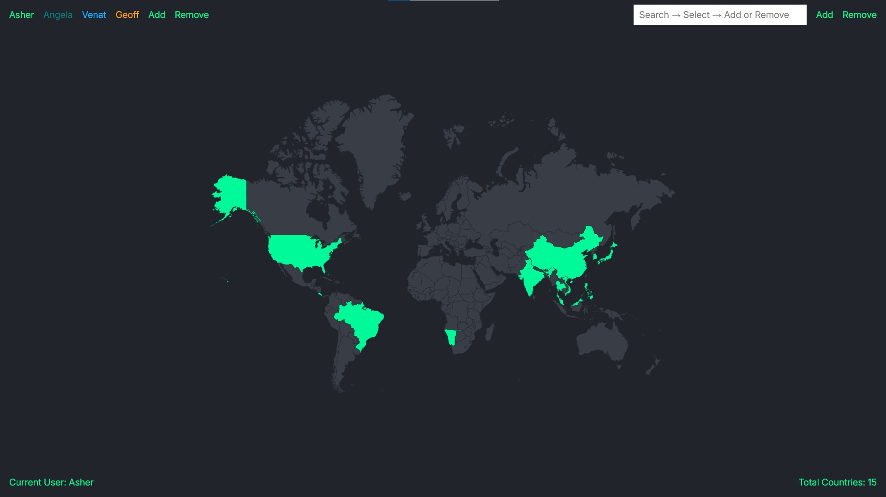
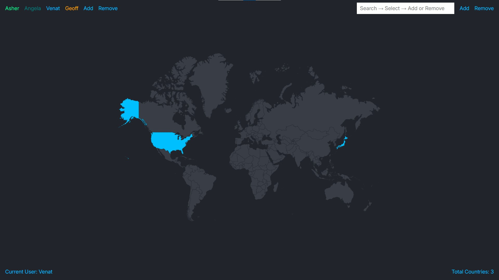

# Family Travel Tracker Modified

## Modified Version Screenshots

## Original Version Screenshot

## How to Use

1. Download and install Node.js and PostgreSQL
2. Configure the following, either in index.js or via a dotenv file:
    - port
    - host
    - database
    - user
    - password
3. Run queries.sql queries in Postgres
4. Start the server and send a get request

## About the App

This project came from a Udemy course by Angela Yu, The Complete 2024 Web Development Bootcamp.\
I modified it the following way:

1. Add new features
   - Add remove user button
   - Add remove country button
   - Add datalist of all countries, searchable and clickable
   - Make certain texts take current user's color (e.g. if you click on Venat, all texts except users' names will turn deep sky blue)
   - Disable deleting last user to prevent ejs crash
2. Rework UI
3. Minimize codes (most notably css)
